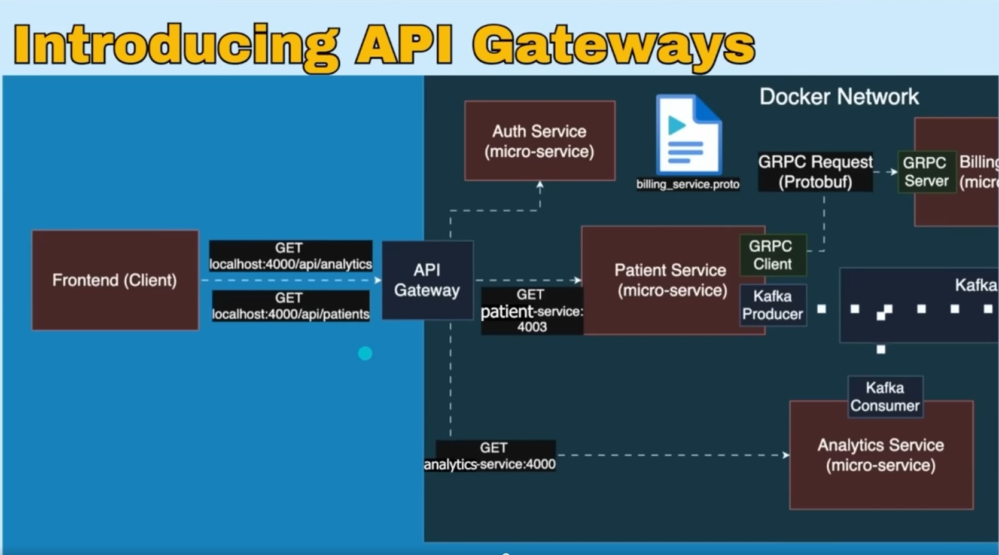

# API Gateway Documentation

# Introduction to API Gateway

API Gateway is a powerful tool that allows developers to create, publish, maintain, monitor, and secure APIs at any scale. 
It acts as a reverse proxy to accept all application programming interface (API) calls, 
aggregate the various services required to fulfill them, and return the appropriate result.

An API Gateway provides a single entry point for all client requests to interact with multiple backend services,
which helps to manage and route traffic efficiently, enforce security policies, and monitor API usage.

Routes requests to the microservices
Hiding the internal addresses from the clients

Handles cross-cutting concerns like authentication, authorization, caching, logging, monitoring and rate limiting centrally,
as they are cross-cutting concerns that apply to multiple or all services.

# Key Features

1. **Request Routing**: Directs incoming API requests to the appropriate backend services based on defined rules.
2. **Load Balancing**: Distributes incoming traffic across multiple backend services to ensure high availability and reliability.
3. **Security**: Implements authentication and authorization mechanisms to protect APIs from unauthorized access.
4. **Rate Limiting**: Controls the number of requests a client can make to prevent
5. **Caching**: Stores frequently accessed data to reduce latency and improve performance.
6. **Monitoring and Analytics**: Provides insights into API usage, performance metrics, and error
7. **Transformation**: Modifies request and response data formats to ensure compatibility between clients and backend services.
8. **Protocol Translation**: Converts between different protocols (e.g., HTTP to WebSocket) to facilitate communication between clients and services.

# Project architecture 

